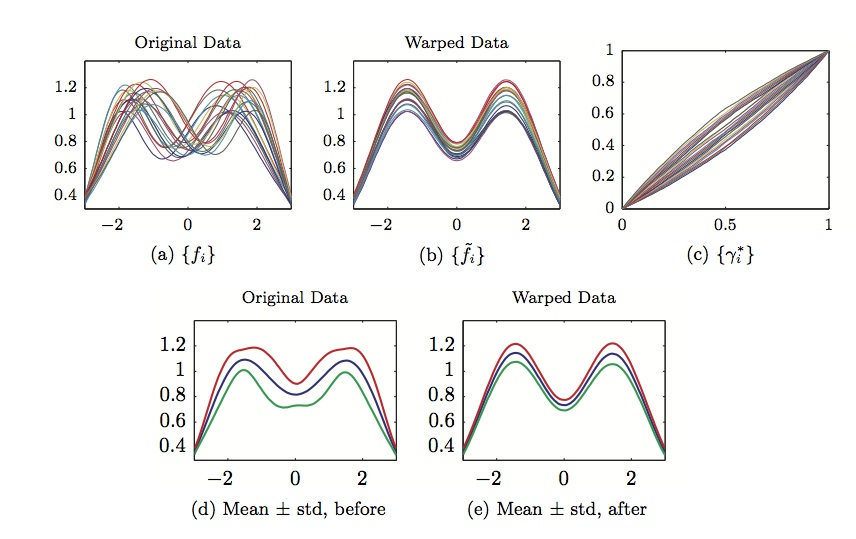

---
---

<link rel="stylesheet" href="styles.css" type="text/css" />
 

My main interest lies in the area of statistical signal and image understanding with a focus on theoretical issues. This research area has also been called computational vision since one seeks to design computerized systems for understanding scenes from camera images, much like our own human vision system. There is a strong need for such tools in **medical diagnostics, face recognition, video surveillance, undersea imaging,terrain mapping**, and **satellite image analysis**. In military domain, the problem of battlefield target recognition continues to motivate newer research which is a vast importance

My current focus is in the area of functional data analysis the focus on the task of clustering and modeling underwater objects using acoustic spectrum is complicated by the uncertainties in aspect angles at different data collections. Small changes in the aspect angles introduce compositional noise in the signals. The traditional alignment techniques are based on energy functions that are not proper distances, and necessitate a separate (and thus suboptimal) choice of distance to compare the aligned functions. We present a comprehensive technique, for removing compositional noise and aligning functions, that: (1) uses a single cost function for data alignment, (2) combines the data and smoothness in natural fashion, and (3) leads to a proper distance between aligned functions. It is based on establishing re-parameterization orbits of functions under the warping group and defining a distance between orbits using the Fisher-Rao metric. Using this metric we can compute a proper covariance and perform functional principal component analysis. From the principal components we can develop models of the y variability (aligned data) and x variability (warping functions) and perform classification. We investigate the use of this framework in modeling and classification of spectral signatures in acoustic data and demonstrate improvements in signal classification using this framework, over current methods.

